# auths-site

Public portal for [Auths](https://github.com/auths-dev/auths) — a decentralized cryptographic identity and signing protocol for software supply chains.

The site showcases zero-trust verification: a user drops a binary into their browser, a WebAssembly engine verifies a decentralized Ed25519 signature chain, and nothing is uploaded anywhere.

## What's in this repo

This is a **pnpm workspace monorepo**:

```
auths-site/
├── pnpm-workspace.yaml
├── package.json              # root scripts, shared devDependencies
├── apps/
│   └── web/                  # Next.js 16 public site (App Router)
│       ├── content/          # Markdown/MDX docs, blog, trust pages
│       └── src/app/          # Routes: /, /explorer, /verify, /docs, /blog
└── packages/
    └── widget/               # <auths-verify> web component + WASM verifier
        ├── src/              # Custom element, resolvers, verifier bridge
        └── wasm/             # Compiled Rust→WASM binary (committed)
```

## Local development

**Prerequisites:** Node.js ≥ 18, pnpm ≥ 9

```bash
# Install all workspace dependencies
pnpm install

# Start the Next.js dev server
pnpm dev
# → http://localhost:3000
```

To rebuild the widget (if you change `packages/widget/src/`):

```bash
pnpm --filter auths-verify build
```

The dev server hot-reloads the Next.js app. Widget changes require a manual rebuild + page refresh.

## Testing

```bash
# Run all tests (widget unit tests)
pnpm test

# Run widget tests only
pnpm --filter auths-verify test

# Watch mode
pnpm --filter auths-verify test:watch

# Typecheck everything
pnpm typecheck
```

## Smoke tests (manual)

After `pnpm dev`:

| URL | Expected |
|-----|----------|
| `http://localhost:3000` | Landing page with `<auths-verify>` widget |
| `http://localhost:3000/explorer` | Empty search input, no errors |
| `http://localhost:3000/explorer?repo=github.com/auths-base/auths` | Resolver fetches identity chain |
| `http://localhost:3000/docs/intro` | MDX docs page with dark prose |
| `http://localhost:3000/blog` | Blog index |
| `http://localhost:3000/verify?repo=github.com/auths-base/auths` | OG metadata + verification result |

## Architecture

```mermaid
graph TD
    subgraph Monorepo["auths-site (pnpm workspace)"]
        subgraph Widget["packages/widget (auths-verify)"]
            WC["&lt;auths-verify&gt;\nCustom Element"]
            RES["Resolvers\ngithub · gitea · detect"]
            WASM["WASM Bridge\nauths_verifier_bg.wasm"]
            WC --> RES
            WC --> WASM
        end

        subgraph Web["apps/web (Next.js 16)"]
            LP["/ Landing Page\n(Server Component)"]
            EX["/ explorer\n(Client Component\nTanStack Query)"]
            VR["/ verify\n(Server Component\ngenerateMetadata → OG)"]
            DOCS["/(content)/[...slug]\n(MDX · next-mdx-remote)"]
            BLOG["/blog\n(MDX index)"]

            LP -->|"lazy import"| WC
            EX -->|"useQuery"| RES
            VR -->|"server-side"| RES
        end
    end

    subgraph External["External (no Auths backend)"]
        GH["GitHub REST API\nrefs/auths/*"]
        GT["Gitea REST API\nrefs/auths/*"]
    end

    RES -->|"fetch()"| GH
    RES -->|"fetch()"| GT

    style WASM fill:#064e3b,color:#10b981,stroke:#10b981
    style WC fill:#18181b,color:#fafafa,stroke:#27272a
    style Widget fill:#0a0a0a,stroke:#27272a
    style Web fill:#0a0a0a,stroke:#27272a
    style External fill:#09090b,stroke:#3f3f46
```



### Key design decisions

| Concern | Decision | Reason |
|---------|----------|--------|
| Widget build | Vite library mode (pre-built dist) | Next.js webpack cannot process `vite-plugin-wasm`; consume compiled output |
| `@auths/verifier` types | Vendored into `packages/widget/src/vendor-types.ts` | Removes `file:` sibling-repo dependency that breaks CI |
| WASM binary | Committed to `packages/widget/wasm/` | No Rust toolchain needed in CI; `wasm/` gitignore removed |
| Explorer data | `resolveFromRepo()` called client-side via TanStack Query | Browser pings GitHub/Gitea REST API directly — no Auths backend |
| `/verify` OG metadata | `generateMetadata` runs server-side | Slack/Twitter reads OG before JS executes |
| SSR safety | `atob()` used in resolvers — safe in Node 18+ | Next.js requires Node 18+; `window`/`document` not referenced |

## Stack

- **Framework:** Next.js 16 (App Router)
- **Styling:** Tailwind CSS v4 + `@tailwindcss/typography`
- **Animation:** [Motion](https://motion.dev) (`motion/react`)
- **Data fetching:** TanStack Query v5
- **Content:** next-mdx-remote (RSC)
- **Widget:** Vite + `vite-plugin-wasm` + `vite-plugin-dts`
- **Testing:** Vitest + happy-dom
- **Package manager:** pnpm workspaces
