# The Auths Ecosystem

**Software identity, fully decentralized.**

Auths combines a permanent cryptographic identity, local device signing, and portable zero-trust verification into a single workflow. It’s a way for developers to sign exactly what they build, and a way for consumers to verify those signatures locally using math—without relying on centralized authorities or ephemeral certificates.

### How does it work?

```mermaid
graph LR
  classDef core fill:#18181b,stroke:#3f3f46,stroke-width:2px,color:#fff,rx:8px,ry:8px;
  classDef action fill:#0284c7,stroke:#0369a1,stroke-width:2px,color:#fff,rx:8px,ry:8px;

  ID["👤 Root Identity<br/>(Permanent DID)"]:::core
  Device["💻 Device Key<br/>(Laptop / CI)"]:::core
  Artifact["📦 Artifact<br/>(Code / Package)"]:::core
  Verify["✅ Verification<br/>(Zero-Trust WASM)"]:::action

  ID -- "Authorizes" --> Device
  Device -- "Signs" --> Artifact
  Artifact -. "Math proves provenance" .-> Verify

```

---

## What can you do with it?

We’ve combined a few powerful cryptographic primitives that operate seamlessly in the background so you can focus on shipping code.

### Sign

Generate a permanent decentralized identity (DID) that survives device loss and key rotations. Bind your local laptop or CI runners to this identity, and sign commits or release artifacts effortlessly without managing raw private keys.

### Discover

Publish your signed attestations to the public registry to build your verifiable Web of Trust. Link your GitHub, GitLab, or Radicle accounts so the world knows exactly which DID belongs to you.

### Verify

Verification happens entirely client-side. The verification engine is compiled to WebAssembly (WASM), meaning anyone can audit an artifact's provenance in their browser, CI pipeline, or terminal—no network calls or centralized servers required.

---

## What's behind the scenes?

**`auths-cli`** Your local control plane. This is the command-line interface you use to create your identity, authorize new devices, and sign software artifacts. Behind the scenes, it manages a local Git repository (`~/.auths`) that acts as your immutable ledger.

**KERI (Key Event Receipt Infrastructure)** The identity protocol powering Auths. Instead of tying your identity to a single, fragile private key, KERI binds your permanent DID to a cryptographic log of key rotations. This makes your identity quantum-resilient and recoverable.

**`auths-verifier`** The portable, zero-trust verification engine. Written in Rust and compiled to native code, WASM, and FFI bindings. It takes an artifact and an attestation and returns a simple Valid/Invalid result based entirely on mathematical proofs.

**`public.auths.dev`** The optional discovery registry. While Auths functions perfectly completely offline, the public registry provides a Postgres-backed index of the ecosystem. It allows consumers to query things like, *"Show me the verified public keys for the GitHub user @torvalds."*

---

## The Auths Lifecycle

1. **Create your permanent identity** When you run `auths id create`, Auths generates a cryptographic inception event. This establishes your permanent identifier (`did:keri:...`). You don't rely on a central Certificate Authority (CA) or OpenID provider; you are your own root of trust.
2. **Authorize your devices** Your root identity doesn't sign code—your devices do. You authorize your laptop or an ephemeral CI server by issuing a cryptographic attestation to it. If a laptop is compromised, you simply revoke its access; your root identity remains entirely secure.
3. **Sign and publish** When you build a release, your local device key signs the artifact's hash. You can then publish this signed attestation to the Auths Public Registry, appending it to the global, auditable Web of Trust.
4. **Zero-trust verification** When someone downloads your software, `auths-verifier` reconstructs the chain of trust: it verifies the artifact was signed by the device, and the device was authorized by your root identity. Because the verifier relies entirely on math, it doesn't need to ask a centralized server for permission.

---

## Frequently Asked Questions

<strong>What happens if I lose my private key?</strong>

Because Auths uses KERI pre-rotation, your identity is not your current key—it is a cryptographic log. During setup, you create a commitment to your <em>next</em> key. If your active device is lost or compromised, you use your pre-committed backup key to rotate your state, preserving your DID and your reputation.

<strong>Do I have to use the public registry?</strong>

No. Auths is a truly decentralized protocol. The public registry is just an index for easier discovery (like a search engine). If the registry goes offline, your local verifications will still work flawlessly as long as you have the raw attestation files.

<strong>What kinds of artifacts can I sign?</strong>

You can sign anything that can be hashed. Currently, <code>auths</code> seamlessly supports Git commits, npm packages, Cargo crates, Docker containers, and raw binary tarballs.

<strong>How does this compare to Sigstore?</strong>

Sigstore is fantastic, but it relies on centralized OIDC providers (like Google/GitHub logins) and ephemeral keys tied to transparency logs. Auths provides <strong>sovereign identity</strong>. You own your root cryptographic material, meaning you aren't beholden to GitHub's uptime, Microsoft's account policies, or a centralized transparency log to prove who you are.

