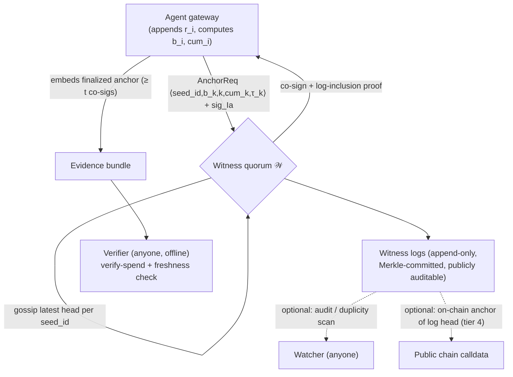

# Auths Witness Network (AWN) — Product & Technical Specification

**Status:** Draft v0.1 · **Owner:** bordumb · **Date:** 19 July 2026
**Depends on:** *Accountability Without Consensus* (per-party signed spend logs, delegated mandates, offline `verify-spend`)
**Audience:** engineering, design partners, and the regulatory trust-framework conversation

---

## 1. Summary

The Auths accountability construction proves *tamper-evidence* and *authorization* offline, from a hash and a signature, with no consensus. It does **not**, on its own, defeat two attacks that a dishonest party can mount for free: **withholding** (declining to present recent records) and **equivocation** (maintaining two internally-consistent, divergent histories and showing different ones to different verifiers). Both are freshness problems, and freshness cannot be established from a log alone — it requires committing the log's head to a party trusted for *ordering*.

The **Auths Witness Network (AWN)** is that layer. It is a threshold-quorum of independent witnesses that co-sign monotone growth anchors over per-party spend chains and publish them to an append-only, publicly auditable **witness log**. This converts withholding into a *signed, detectable gap* and equivocation into a *signed, publishable contradiction* — without the witnesses ever seeing the counterparty graph, holding funds, ordering transactions across parties, or being trusted for authorization (which still re-derives offline).

AWN is also the commercial core of Auths. Offline verification is free and vendor-neutral by design; **operating the witness quorum, the log, the pinning tier, and the SLA around them is the product.** Customers do not pay to verify — they pay to be *un-withholdable* and *provably fresh* to their counterparties, auditors, and regulators.

---

## 2. Background & motivation

Two facts frame this work.

**The gap is real and named.** The security paper states plainly that the anchoring layer is "at once the least-developed part of the design and the most load-bearing for the accountability claim," and that the construction "converts *forgery* (which it defeats) into *withholding* (which it does not, absent a witness)." AWN is the resolution of that sentence. It also closes the **equivocation gap**: Proposition 4 defends against rollback (a *smaller* head than one witnessed) but not against a two-faced log that forks into two consistent futures. A KERI-style non-duplicity witness, extended from key events to *spend* chains, is required and is not yet specified in the paper.

**The market has converged on the mandate, not the audit.** As of mid-2026, signed scoped mandates ship in Google AP2 (60+ partners), Visa Trusted Agent Protocol, Stripe MPP, and Skyfire. The *authorization primitive* is table stakes. What none of them provides — and what the Bank of England explicitly worried about ("fragmentation and walled gardens as AI firms and payment systems all develop protocols") — is an accountability record that re-derives **across all of them**, offline, trusting no rail. AWN is the neutral substrate that makes that cross-rail audit *fresh and un-withholdable*. Auths is therefore positioned **above** the mandate protocols as their shared adjudication layer, not as a fifth competing mandate.

---

## 3. Goals & non-goals

### Goals

- **G1 — Anti-rollback (freshness).** Make any truncation or rollback below a witnessed index a signed contradiction (formalizes Prop 4 into a running service).
- **G2 — Anti-equivocation (non-duplicity).** Make any two divergent heads at the same chain index publicly detectable and attributable to the forging party.
- **G3 — Withholding detection.** Turn "a party stopped presenting its chain" into a signed, timestamped fact its counterparties can point to.
- **G4 — Trust distribution.** No single witness is a trusted party; verifiers trust a *threshold* of a party's *declared, signed* witness set.
- **G5 — Neutrality.** Attest chains regardless of payment rail; never touch funds, never order cross-party transactions.
- **G6 — Privacy.** Witnesses learn only `⟨chain-id, head, index, cumulative, timestamp⟩` — never per-record detail or the counterparty graph.
- **G7 — Cheap verification preserved.** Adding AWN must not make offline verification require a network call in the common case; anchors travel *inside* the evidence bundle.
- **G8 — A defensible operating business** that monetizes operation, SLA, and pinning without charging for verification.

### Non-goals

- **NG1** — Not a payment rail; never custodies or moves money.
- **NG2** — Not consensus; witnesses do not agree on a global order across parties, only attest monotone growth of *single* chains.
- **NG3** — Not the authorization logic; verdicts (`authorized`, `out-of-counterparty`, …) re-derive offline from the signed prefix, with or without AWN.
- **NG4** — Not a global transaction ledger; the witness log stores anchors (heads + aggregates), not transactions, by privacy design.
- **NG5** — Not a guarantee of record *availability* against a determined withholder in the base tier; AWN guarantees *detectability* of withholding and offers *availability* only in the optional pinning tier (§11, honestly scoped).

---

## 4. Personas

- **Principal / fleet operator.** Wants its agents provably within remit and wants counterparties unable to later deny or truncate shared history. Buys anchoring + SLA.
- **Counterparty / merchant.** Wants the other side un-withholdable in a dispute, and wants to detect equivocation before settling repeatedly.
- **Auditor / chargeback desk / regulator.** Wants an evidence bundle that re-derives offline *and* carries a fresh, threshold-signed anchor proving the presented head is the latest. Never onboards; verifies with open-source tooling.
- **Witness operator.** A neutral party (auditor firm, industry body, regulator-adjacent trust framework, or Auths itself) running a witness for reputational or contractual stake.

---

## 5. Terminology

Reusing the paper's notation.

| Term | Meaning |
|---|---|
| `seed_id` | `H(I_a ‖ M)` — stable identifier of one agent-under-mandate spend chain |
| `b_k` | head after `k` records: `b_k = H(b_{k-1} ‖ canon(r_k))` |
| `k` | chain index (record count) |
| `cum_k` | signed cumulative asserted spend at index `k` |
| `τ_k` | monotone timestamp asserted at index `k` |
| **Anchor** | `⟨seed_id, b_k, k, cum_k, τ_k⟩` — the only tuple a witness ever sees |
| **Co-signature** | a witness's signature over an anchor: `Sign_W(anchor)` |
| **Threshold** `(t, N)` | anchor is *final* when ≥ `t` of the party's `N` declared witnesses have co-signed |
| **Witness set** `𝒲` | the party's declared witnesses + threshold, signed into `M`/its KEL by the principal |
| **Witness log** | append-only, Merkle-committed log of anchors a witness publishes |
| **Duplicity proof** | two validly co-signed anchors for the same `seed_id` at the same `k` with `b_k ≠ b_k'` |

---

## 6. Requirements

### Functional

- **FR-1** A witness accepts an `AnchorReq`, validates the requester's signature under `I_a`'s current key state, and enforces per-`seed_id` monotonicity: `k` strictly increasing, `cum` and `τ` non-decreasing versus the highest anchor it has co-signed for that `seed_id`.
- **FR-2** A witness MUST refuse any `AnchorReq` presenting a head `b_k' ≠ b_k` at an index `k` it has already co-signed for that `seed_id`, and MUST emit a **duplicity proof** (the two conflicting signed anchors).
- **FR-3** On acceptance, a witness co-signs the anchor, appends it to its witness log, returns the co-signature and a log-inclusion proof, and gossips the new per-`seed_id` head to peer witnesses (§9.4).
- **FR-4** A party assembles ≥ `t` co-signatures into a **finalized anchor** and embeds it in every evidence bundle emitted after index `k`.
- **FR-5** `verify-spend` gains a freshness check: given a bundle at head `b_n` and a finalized anchor at `b_m`, it confirms `n ≥ m` and that `b_n` extends `b_m`; if the bundle's head is *behind* any anchor the verifier can reach, it returns `stale` (a distinct verdict from `inconsistent`).
- **FR-6** Any party (verifier, counterparty, watcher) MAY audit a witness log for consistency (append-only) and for duplicity across the whole log.
- **FR-7** Witnesses expose a "latest anchor for `seed_id`" read endpoint so a counterparty can detect a withholding gap (`now − τ_latest`) without holding records.
- **FR-8** (Pinning tier) A pinning service MAY store canonical records and serve inclusion/availability proofs; a proven non-response is itself a signed, publishable fact.

### Non-functional

- **NFR-1 — Witness cost O(1).** Per-request state and work are O(1) in chain length; a witness holds only the latest anchor per `seed_id` plus its log's Merkle frontier.
- **NFR-2 — Verifier offline in the common case.** A finalized anchor inside a bundle needs no network call; network reads (FR-7) are only for *live* withholding detection.
- **NFR-3 — Privacy.** No witness endpoint or log entry exposes per-record fields, counterparties, or `h(x)` arguments.
- **NFR-4 — Liveness under partial failure.** With `N` witnesses and threshold `t`, the network anchors while any `t` are reachable; `t ≤ ⌈(N+1)/2⌉` recommended for availability, higher for stronger duplicity resistance (§7).
- **NFR-5 — Portability.** Anchor verification is bound out to Rust/Python/JS/WASM as one implementation, matching `verify-spend`.

---

## 7. Trust & threat model

**What a witness IS trusted for:** *ordering and liveness only* — that the `(k, cum, τ)` it co-signs are monotone and that it does not co-sign two heads at one index. Nothing else.

**What a witness is NOT trusted for:** authorization (verdicts re-derive offline), record contents (witnesses never see them), amounts (adjudicated by the rail per Definition 2), or availability of records (base tier).

**Adversaries and defenses:**

| Adversary | Attack | AWN response |
|---|---|---|
| Withholding party | Stops presenting recent records | Latest anchor (FR-7) proves a higher `(k, cum)` existed at `τ`; the gap is signed and pointable (G3). Detected, not prevented. |
| Equivocating party | Forks into two consistent histories | Same-index-different-head is refused by any single honest witness (FR-2) and surfaced as a duplicity proof across the log/gossip (G2). Requires **all** its declared witnesses to be complicit *and* the fork never to reach an honest watcher. |
| Rolling-back party | Republishes an earlier head | Contradicts a later finalized anchor with higher `(k, cum, τ)` (Prop 4). |
| Malicious witness | Co-signs a fork, or refuses service | A co-signed fork *is* a duplicity proof against that witness (slashable/reputation, §14). Refusal is routed around by threshold `t < N`. A single witness cannot finalize alone. |
| Colluding party + `< t` witnesses | Tries to finalize a forked anchor | Fails: finalization needs `t` co-signatures; below threshold there is no finalized anchor, so verifiers see `stale`/unanchored and decline to rely. |
| Colluding party + `≥ t` witnesses | Finalizes a fork | **Succeeds** if and only if the party's *own declared* witness set is `t`-corrupt. This is the residual trust, and it is (a) chosen and signed by the principal in the open, (b) bounded by threshold, and (c) still catchable by any honest watcher who sees both forks and publishes the duplicity proof. Stated, not hidden. |

**Key honesty:** AWN reduces the freshness problem to "the party's declared witness quorum is not `t`-corrupt AND at least one honest watcher observes each fork." This is strictly weaker than global consensus (no agreement on cross-party order, no leader, no liveness race) and strictly stronger than the base construction (which had no freshness at all). It is not zero-trust; it is *minimized, declared, and thresholded* trust.

---

## 8. Architecture



The gateway is the only component that sees records. Witnesses see anchors. Verifiers see bundles (records + finalized anchor). Watchers see logs (anchors only). Money never enters this diagram.

---

## 9. Core protocol

### 9.1 Anchor request

```
AnchorReq {
  seed_id      : bytes32        // H(I_a ‖ M)
  index        : uint64         // k
  head         : bytes32        // b_k
  cumulative   : uint128        // cum_k (asserted, matches signed record)
  timestamp    : uint64         // τ_k, monotone
  witness_set  : ref            // pointer to 𝒲 as anchored in M/KEL
  prev_anchor  : optional       // last finalized anchor, for O(1) monotonicity binding
  sig_Ia       : signature      // over all of the above, under I_a device key
}
```

The witness does **not** verify chain consistency between `prev_anchor.head` and `head` — that is the offline verifier's job when it holds the records. The witness verifies only: signature validity under `I_a`'s current key state, and monotonicity/uniqueness against its own last co-signed anchor for `seed_id`.

### 9.2 Witness acceptance rule

```
on AnchorReq req:
  assert verify(req.sig_Ia, keystate(I_a, req.timestamp))
  last = store.get(req.seed_id)          // O(1)
  if last exists:
    if req.index == last.index and req.head != last.head:
        return DUPLICITY(last, req)       // FR-2: refuse + prove
    assert req.index > last.index
    assert req.cumulative >= last.cumulative
    assert req.timestamp  >= last.timestamp
  cosig = Sign_W(anchor_of(req))
  proof = log.append(anchor_of(req))      // Merkle inclusion proof
  store.put(req.seed_id, req)             // O(1) state
  gossip(req.seed_id, anchor_of(req))     // §9.4
  return { cosig, proof }
```

### 9.3 Finalization & bundle embedding

A party collects co-signatures until it holds ≥ `t` from distinct witnesses in its declared `𝒲`. The **finalized anchor** = `{ anchor, [cosig_1 … cosig_t], log_proofs }`. Every evidence bundle emitted thereafter embeds the highest finalized anchor whose `index ≤ n`. `verify-spend` then runs its freshness check (FR-5) with zero network calls.

### 9.4 Gossip / watcher layer

Witnesses periodically exchange their latest per-`seed_id` anchors (or their signed log heads) with peers. A watcher — which anyone may run — pulls witness log heads and scans for two anchors on one `seed_id` at one `index` with differing heads. Finding one yields a duplicity proof, publishable anywhere, that attributes the fork to the party (both anchors carry `sig_Ia`). This is the mechanism that upgrades single-witness refusal (FR-2) into *global* non-duplicity: to equivocate undetected, a party must corrupt `t` of its own witnesses **and** ensure no honest watcher ever sees both forks.

---

## 10. Deployment tiers (the anchoring ladder as product tiers)

The paper's §5.3 ladder becomes the pricing and assurance model. A bundle **states which tier produced its anchor**, so a verdict is never stronger than its evidence.

| Tier | Mechanism | Defeats | Trust assumption | Product |
|---|---|---|---|---|
| **0 — TOFU** | trust-on-first-seen head | nothing beyond tamper-evidence | verifier's own memory | free / self-host |
| **1 — Single witness** | one first-party AWN witness co-signs | rollback vs. that witness | one honest witness | entry SaaS |
| **2 — Quorum** | `t`-of-`N` declared witnesses | rollback + equivocation (w/ watchers) | `< t` of `𝒲` corrupt | standard SaaS |
| **3 — Transparency co-sign** | quorum + public append-only logs + watchers | equivocation globally | ≥1 honest watcher | compliance tier |
| **4 — On-chain anchor** | periodic log-head commit to public chain calldata | witness-set collusion over time | the public chain's ordering | regulated / high-value |

Tiers compose upward; a customer picks the assurance its counterparties and regulators require and pays accordingly. Note tier 4 uses a chain only to *timestamp a log head periodically* — cheap, no per-transaction consensus, and optional.

---

## 11. Security properties provided

- **Anti-rollback (Prop 4, operationalized).** Any republished head with `cum < cum_finalized` or `τ < τ_finalized` is a witness-signed contradiction. **Tier ≥ 1.**
- **Anti-equivocation (new; closes the paper's gap).** Same-`seed_id`, same-`index`, different-`head` anchors constitute a duplicity proof; refused locally (FR-2), detected globally (§9.4). **Tier ≥ 2 with watchers.**
- **Withholding → detectable.** A signed latest anchor makes "no records since `τ`" a checkable, pointable claim; it does not *force* production. **Tier ≥ 1.** Record *availability* is only guaranteed under the optional **pinning tier** (§12), and even then against non-response, not against a party that never pinned — stated honestly, matching NG5.
- **Preserved:** tamper-evidence (Prop 2), authorization-unforgeability (Prop 3), and offline re-derivability are untouched; AWN adds freshness *beside* them, never gates them.

---

## 12. Availability / pinning tier (optional, honestly scoped)

Anchors prove *what index a chain reached*; they do not store records. To make records retrievable in a dispute, an optional pinning service stores `canon(r_i)` (or their ciphertext, with the verifier holding keys) and serves inclusion + availability proofs bound to witnessed heads. A *proven non-response* by a pinner that a party contracted with is a signed, publishable breach. This is the only tier that touches record availability, and it is explicit that it defends against a *pinner's* non-response, not against a party that never pinned in the first place — consistent with the construction's stance that cryptography detects, and incentives (§13) pull activity onto the record.

---

## 13. Economics & operating model

**The tension to resolve:** offline verification is free and vendor-neutral by design — "re-derivable, trusting no vendor, including us." So the business cannot be *verification*. It is *operation*:

- **Anchoring-as-a-service.** Throughput, latency SLA, and per-`seed_id` anchoring cadence. The recurring line.
- **Witness-quorum operation.** Auths runs a first-party quorum; customers pay for its availability guarantees and for the convenience of a curated, reputable default `𝒲`.
- **Transparency-log hosting + watcher tooling.** Dashboards that turn "is my counterparty withholding / equivocating" into a monitored alert.
- **Pinning + evidence-bundle custody.** Storage and retrieval SLAs (§12).

**Why it stays trust-minimized while being a business:** the protocol is open; third parties (auditors, an industry trust framework, the counterparty itself) can run witnesses, and a party's declared `𝒲` can *mix* Auths and non-Auths witnesses. Auths sells *operating a good default and the SLA around it*, not the right to verify. This directly answers "what does the customer pay for": they pay to be **provably fresh and un-withholdable** to others — a property they cannot self-provide — while their counterparties still verify for free.

**Witness incentive / integrity:** two models, selectable per `𝒲`.
- *Federated/reputational* — witnesses are named, reputable neutrals; a published duplicity proof is a reputational loss. Fits the UK "trust framework" framing and needs no token.
- *Staked/slashable* — witnesses bond; a duplicity proof or proven refusal slashes the bond. More adversarial, crypto-native.

A regulator-operated or industry-body witness in `𝒲` is the strongest neutral option and a natural outcome of the Treasury consultation; AWN is designed so such a witness can join a party's set without Auths in the loop.

---

## 14. Interfaces (sketch)

```
POST /v1/anchor            → AnchorReq → { cosig, log_inclusion_proof } | Duplicity
GET  /v1/anchor/{seed_id}  → latest finalized anchor (FR-7, withholding detection)
GET  /v1/log/head          → signed witness-log head (for watchers, tier 3)
GET  /v1/log/consistency   → consistency proof between two log heads
POST /v1/pin               → store canon(r_i) ciphertext, return inclusion proof (tier)
GET  /v1/pin/{head}/{i}    → record + availability proof | signed non-response
```

Client libraries (Rust/Python/JS/WASM) expose `anchor(chain_state) → finalized_anchor` and extend `verify_spend(bundle) → { verdict_vector, freshness: fresh|stale|unanchored }`.

---

## 15. Failure modes & degradation

- **Quorum unreachable.** Gateway keeps appending records; anchoring queues and retries. Bundles emitted meanwhile carry the last finalized anchor and are `fresh` up to that index, `unanchored` beyond it — a truthful, graceful degradation, never a hard stop on spending.
- **Witness disagreement on key state.** Anchors bind to `I_a`'s KEL-derived key state at `τ`; a witness on a stale KEL view rejects and re-syncs via KERI witnessing — reuse, don't reinvent.
- **Clock skew.** `τ` is monotone-asserted by the party and only *co*-signed; witnesses enforce non-decrease, not absolute accuracy. Absolute time is a tier-4 concern (on-chain anchor).
- **Log growth.** Witness logs are anchors-only (tens of bytes each), Merkle-compacted; storage is modest and independent of transaction *volume* within a chain (one anchor per cadence, not per record).

---

## 16. Rollout

- **Phase 0 — Single first-party witness (tier 1).** Ship anchoring + the `stale` verdict in `verify-spend`. Proves the freshness path end-to-end.
- **Phase 1 — Quorum + gossip (tier 2).** Threshold finalization, duplicity proofs, watcher-scannable logs. Closes equivocation for customers who run/trust a watcher.
- **Phase 2 — Public transparency logs + watcher tooling (tier 3).** Alerts, dashboards, third-party witness onboarding. This is where the compliance product lives.
- **Phase 3 — On-chain log anchoring (tier 4) + pinning.** For regulated/high-value flows; optional.

Each phase is independently shippable and independently sellable.

---

## 17. Success metrics

- % of evidence bundles carrying a tier-≥2 finalized anchor.
- Median anchor finalization latency; anchoring availability (uptime of `t`-of-`N`).
- Duplicity proofs surfaced (should be ~0 in honest operation; each one caught is a proof the layer works).
- Withholding gaps detected and actioned by counterparties (product value made legible).
- Third-party (non-Auths) witnesses in customer `𝒲` sets — the neutrality metric that proves it isn't a walled garden.

---

## 18. Open questions

- **Cross-epoch unlinkability vs. anti-equivocation.** A stable `seed_id` is required to detect forks but is itself a linkage identifier. Is a per-epoch blinded `seed_id` (rotating HMAC) worth the weaker cross-epoch equivocation detection? Likely offer both, default to stable.
- **Consistency proofs.** Should the spend log be Merkle-committed (CT-style, O(log n) consistency/inclusion proofs) rather than a pure linear hash chain? This also softens the §4.2 per-agent serialization limit. Trade-off vs. the paper's simpler construction — recommend Merkle log as an option, linear chain as the floor.
- **Regulator-as-witness.** What is the minimal interface for a Treasury-trust-framework witness to join `𝒲` without operational dependence on Auths? Designing for this now is cheap and strategically decisive.
- **Watcher incentives.** Who runs watchers, and why? Counterparties have skin in the game (they're the withholding victim); is that sufficient, or does tier 3 need a bounty for published duplicity proofs?

---

## 19. Operability: code-as-infrastructure and one-command witnesses

### 19.1 Deployability is a trust property, not a convenience

The neutrality claim (§13, I-TRUST-3) is only real if a principal can populate its declared witness set `𝒲` with witnesses it *doesn't* operate — an auditor's, a counterparty's, an industry body's, a regulator's. That is credible only if standing up a witness is a near-zero-effort, *verifiable* act. If running one requires a dedicated ops team, every `𝒲` collapses to "whoever has the ops budget," which in practice means Auths — the walled garden the whole design exists to avoid. So the operability bar is load-bearing on the security argument: **easy-to-stand-up is what makes distributed trust true rather than aspirational.**

One honesty guardrail up front, carried over from the watcher discussion: *easy to stand up is not the same as casual to run.* A witness is still a durable, always-on, independently-hosted service whose entire value is non-amnesiac memory (I-DUP-1). One-command deployment still provisions real durable storage and a real protected key; it does not lower the durability bar to phone-grade. We are removing operational friction, not the operational contract.

### 19.2 Ports and adapters (hexagonal core)

The witness *domain core* is small and pure — essentially the acceptance rule of §9.2: verify `sig_Ia`, enforce monotonicity/uniqueness, co-sign, append, gossip. It depends only on a fixed set of **ports** (interfaces). Every difference between laptop, cloud, and air-gapped on-prem is an **adapter** behind one of these ports. The core imports interfaces, never a vendor SDK.

| Port | Contract (what any adapter must guarantee) | Example adapters |
|---|---|---|
| **AnchorStore** | Per-`seed_id` latest-anchor state with **atomic compare-and-set on `(seed_id, index)`** and linearizable single-writer semantics per `seed_id`. This is where I-DUP-1 physically lives. | embedded (SQLite/RocksDB), Postgres/RDS, Cloud SQL, DynamoDB (conditional writes), Spanner |
| **Log** | Append-only, Merkle-committed; serves inclusion + consistency proofs; never rewrites (I-DEGRADE-3). | local file + object store (S3/GCS/Azure Blob), Trillian backend |
| **KeyState** | Resolve `I_a`'s KEL-derived key state as of a timestamp, to verify `sig_Ia`. | KERI watcher/witness client, cached KEL resolver, static (test) |
| **Signer** | Sign an anchor with the witness's own key; expose `sign()`, **never `export()`** (I-DEPLOY-3). | file key (dev), AWS/GCP/Azure KMS, PKCS#11/YubiHSM/TPM (on-prem) |
| **Peer / Gossip** | Exchange latest per-`seed_id` heads and signed log heads with peers. | HTTP pull, libp2p, NATS/Kafka, or none (single-witness tier 1) |
| **AnchorSink** *(tier 4, optional)* | Publish periodic log-head commitments to an external ordering source. | EVM calldata, Bitcoin OP_RETURN, another transparency log |
| **PinStore** *(pinning tier, optional)* | Store record ciphertext; serve availability proofs or a signed non-response (§12). | object store, IPFS, operator disk |

The rule that makes this safe to improvise within: **an adapter swap must be behavior-preserving** (I-DEPLOY-1). Two witnesses running identical cores over different adapters must produce identical co-signatures on identical anchors. Adapters change *where state lives and how it's signed*, never *what is decided*.

### 19.3 One command in, three ways out

The deliverable is a single, self-contained **witness node** artifact (one container image / one static binary) that bundles the core plus a default adapter set, and picks up managed adapters from environment or config. Three deployment surfaces, all one step:

| Target | Command | What it stands up |
|---|---|---|
| **Laptop / on-prem / air-gapped** | `docker compose up` (or the single static binary) | Full node: embedded AnchorStore, local+object Log, file-or-TPM Signer, gossip on, operator console + public status page. Zero external dependencies. |
| **Any single cloud** | `terraform apply` (module per provider) or `helm install` | Node + managed durable adapters: managed SQL for AnchorStore, object store for Log, cloud KMS/HSM for Signer, TLS, DNS, the console. |
| **Hosted quickstart** | `npx create-auths-witness` | Detects environment, provisions the above, joins a starter peer set, prints the witness's public key and endpoints ready to hand to a principal for their `𝒲`. |

The **frontend** ships in the same artifact and is two things: an authenticated **operator console** (health, anchors served, latest-head-per-seed, duplicity alerts, log head, `𝒲`-membership flow) and an unauthenticated **public status page** (liveness, log head, latest anchor timestamps). The status page is not cosmetic — it is itself part of the withholding-detection story (FR-7): a counterparty points at it to prove a witness *was* attesting a chain at time `τ`.

The **IaC is the product's "code as infrastructure":** the Terraform/Pulumi modules and Helm chart are versioned, pinned to an image digest, and are the same artifacts Auths uses to run its own quorum. A regulator or auditor stands up an identical witness from identical published code — no bespoke setup, no Auths dependency in the running system.

### 19.4 Verifiable operation (so a witness is trustable, not just runnable)

A declared witness is only as trustworthy as the assurance it runs honest code. Ease of deployment must come with **provenance of what got deployed**:

- **Reproducible builds.** The witness image is built reproducibly from tagged source; anyone can rebuild and confirm the digest.
- **Signed, transparency-logged releases.** Release artifacts are signed and logged (Sigstore/Rekor) — pleasingly recursive: the witness binary is itself entered in a transparency log before it goes on to witness others.
- **Attestable runtime (optional, regulated tier).** For the highest tier, the node runs in a TEE and serves a remote-attestation quote binding the running image digest to its signing key, so a principal adding it to `𝒲` can verify *this key is held by this audited code*.

This is what turns "anyone can run a witness" into "anyone can run a witness *you can verify you're trusting correctly*" — the operability analogue of the offline-re-derivable evidence bundle.

### 19.5 Deployment invariants (extends the Appendix A contract)

- **I-DEPLOY-1 — Behavior-preserving portability.** Swapping any adapter never changes a verdict or a co-signature. Portability is a property of the boundary, never of the core's decisions.
- **I-DEPLOY-2 — Consistency is where I-DUP-1 lives.** The AnchorStore adapter *must* provide atomic compare-and-set and linearizable single-writer semantics per `seed_id`. An adapter that cannot guarantee this (eventually-consistent stores without conditional writes, multi-writer caches) is disqualified — because at that layer, two accepted heads at one index is exactly the equivocation the network exists to prevent.
- **I-DEPLOY-3 — Keys never leave.** The Signer port exposes `sign()` only; the witness signing key is never exported in cleartext by any adapter or deployment path.
- **I-DEPLOY-4 — Provenance.** A witness node is reproducibly built and its running image digest is attestable; an operator can always prove which code it runs.
- **I-DEPLOY-5 — Safe by default.** The default configuration is the minimal-trust one: single-writer durable store, append-only log, no key export, gossip enabled. Insecure adapter combinations are not reachable through the one-command path — they require deliberate override.
- **I-DEPLOY-6 — No half-nodes.** One command yields a *fully* functioning witness with every required port bound to a working adapter, or it fails closed. A partially-configured witness never serves co-signatures.

A note the building model should not miss: I-DEPLOY-2 is the subtle one. It is tempting, under a "make it deploy anywhere" goal, to allow a cheap eventually-consistent store as an AnchorStore adapter. That single accommodation silently breaks I-DUP-1 — the network's whole reason to exist — with no crash and no error, just a witness that will one day co-sign a fork. Portability stops exactly at the consistency contract.

---

## Appendix A — Invariants: the grounding contract

These are the properties that must hold in **every** execution, regardless of how the system is built. They are not implementation guidance and they are not suggestions. If a design choice violates one, the design is wrong — not the invariant. Everything above (protocol, schemas, tiers) is one valid way to satisfy these; a different implementation that keeps all of them is equally valid. Build freely inside this fence.

Three of them are the crown jewels — **I-DUP-1, I-VERIFY-1, I-FINAL-1**. If a change appears to require weakening any of those, stop: it is almost certainly reintroducing consensus, a trusted verifier, or a single point of trust, which is the exact thing this system exists to avoid.

Each invariant is stated as an always/never, with the reason it exists — because the reason is what lets you improvise safely.

### Trust boundary — what a witness may know and do

- **I-TRUST-1.** A witness *never* receives, stores, or logs a record `r_i`, a counterparty, a capability `κ`, an amount's provenance, or the argument hash `h(x)`. Its entire input is the anchor tuple `⟨seed_id, b_k, k, cum_k, τ_k⟩`. *(If a witness can learn the counterparty graph, both privacy and the minimal-trust surface collapse.)*
- **I-TRUST-2.** Everything a witness signs is a pure function of the anchor tuple and the witness's own prior anchor state — *nothing* derived from record contents. *(You may add signed fields; only if they are computable from the anchor alone.)*
- **I-TRUST-3.** The declared witness set `𝒲` and threshold `t` for a chain are fixed by the **principal's** signature and are immutable to the agent, the gateway, and any witness. Changing them is itself a signed principal event. *(Trust placement is always the principal's choice, in the open.)*

### Anchor content

- **I-ANCHOR-1.** An anchor's `head` and `cum` *always* equal the head and signed cumulative the chain itself commits at that `index`. An anchor may never assert a chain state the chain does not sign. *(The anchor cannot lie about the chain relative to the chain's own signatures.)*
- **I-ANCHOR-2.** For any `seed_id`, across every anchor that party ever gets co-signed, `index` is strictly increasing and `cum`, `τ` are non-decreasing. *(Monotone growth is the whole basis of anti-rollback.)*
- **I-ANCHOR-3.** `spent()` and every authorization verdict are computed *only* from amounts committed into records at append time (`asrt(r)`) — never from live rail state, and never from any witness data. *(Preserves determinism; a witness must never become an input to a verdict.)*

### Non-duplicity — anti-equivocation (crown jewels)

- **I-DUP-1.** A witness *never* co-signs two anchors with the same `seed_id` and same `index` but different `head`. **This is the invariant on which all anti-equivocation rests.** Nothing may weaken it.
- **I-DUP-2.** Presented a conflicting head at an already-co-signed `(seed_id, index)`, a witness *always* refuses and *always* emits the duplicity proof. Detection is never silent, never deferred.
- **I-DUP-3.** Every anchor *always* carries the party's `sig_Ia`, so every duplicity proof is attributable to a specific party. There is no anonymous fork.
- **I-DUP-4.** A party has *at most one* finalized anchor per `index`. Two finalized anchors at one `index` with differing heads is, by definition, a published contradiction against that party.

### Finalization

- **I-FINAL-1.** A finalized anchor *never* exists with fewer than `t` co-signatures from *distinct* witnesses in the chain's declared `𝒲`. No single witness, and no sub-threshold set, can finalize anything. *(No single point of trust — ever.)*
- **I-FINAL-2.** A co-signature from a witness outside the declared `𝒲` *never* counts toward finalization. *(Trust is only ever placed in the declared set.)*

### Offline verification (crown jewel + determinism)

- **I-VERIFY-1.** The authorization verdict vector is *always* computable from the evidence bundle alone — offline, no network, no witness. AWN is additive; it *never* gates, delays, or alters authorization. **If verification ever requires a live witness call, the design is broken.**
- **I-VERIFY-2.** `verify-spend` is deterministic: any two verifiers, anywhere, anytime, on the same bundle, produce the same verdict vector and the same freshness result. *(No ambient state; identical live and offline.)*
- **I-VERIFY-3.** Freshness is *always* a separate, explicitly-labeled result (`fresh` / `stale` / `unanchored`), never folded into the authorization verdict. A stale bundle is not an unauthorized one; conflating them is forbidden.
- **I-VERIFY-4.** A bundle *always* declares the anchor tier that produced it, and a verifier *never* reports a freshness assurance stronger than that tier supports. *(A verdict is never stronger than its evidence.)*

### Honest scope of the freshness guarantee

- **I-FRESH-1.** AWN guarantees withholding and rollback are *detectable*; it *never* claims to *prevent* them. No component, message, or document may assert prevention where only detection holds. *(The honesty of the security claim is itself a feature — protect it as one.)*
- **I-FRESH-2.** Record *availability* is guaranteed only in the pinning tier, and only against a contracted pinner's non-response — never against a party that never pinned. This boundary is restated wherever availability is claimed.
- **I-FRESH-3.** The residual trust assumption is *always* explicit: freshness holds unless a party's own declared `𝒲` is `t`-corrupt **and** no honest watcher observes the fork. This is never hidden behind a "trustless" label.

### Neutrality and money

- **I-NEUTRAL-1.** No AWN component *ever* holds, moves, references, or has authority over funds. AWN's entire surface is anchors and proofs; money lives only on the external rail.
- **I-NEUTRAL-2.** A witness *never* orders transactions across different parties or chains. The only ordering it attests is the monotone growth of one `seed_id`. There is no global order, ever.
- **I-NEUTRAL-3.** No anchor, verdict, or attestation depends on which rail settled. *(Rail-agnostic by construction.)*

### Fail-safe degradation

- **I-DEGRADE-1.** Anchoring unavailability *never* blocks spending or appending. The gateway always keeps producing signed records and defers anchoring. *(AWN is an audit layer, not a gate — fail open on liveness.)*
- **I-DEGRADE-2.** When a bundle's head is beyond its latest finalized anchor, the verifier *always* returns `unanchored` truthfully — it never presents an un-anchored suffix as `fresh`. *(Truthful degradation.)*
- **I-DEGRADE-3.** A witness log is append-only: a witness *never* rewrites, reorders, or deletes a logged anchor. A log that cannot prove append-only consistency is treated as compromised.

### The creativity fence — what any extension must preserve

- **I-EVOLVE-1.** Any change to chain or log structure (e.g., Merkle-committing) *must* preserve all three of: tamper-evidence reducing to `H`-collision, offline re-derivability with no witness, and O(1) witness cost. A faster design that breaks any of these is wrong.
- **I-EVOLVE-2.** Any new witness-signed field *must* be derivable from the anchor tuple alone (see I-TRUST-2). No extension may widen what a witness learns about a transaction.
- **I-EVOLVE-3.** No optimization may turn any AWN service into a *required online dependency* for authorization verification. Convenience endpoints are allowed; mandatory ones are not.
- **I-EVOLVE-4.** Any new verdict, tier, or proof type is fail-closed for *safety* and fail-open for *liveness*: ambiguity resolves to a *weaker assurance* claim, never a stronger one, and never to blocking spend.

### How to use this contract

Before shipping any component, check it against this list. The useful test is adversarial: for each invariant, ask "what input or code path would violate this?" — if you can construct one, the component isn't done. Most subtle bugs in a system like this are not crashes; they are an invariant quietly weakened (a witness call that sneaks into the verify path, a freshness result that masquerades as authorization, a witness that learns one field too many). The invariants are where correctness lives; the rest is style.
